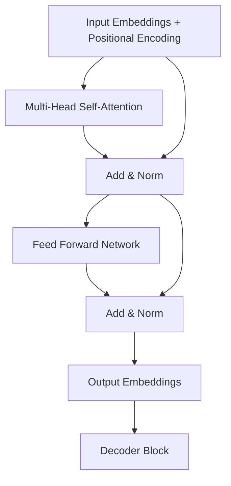
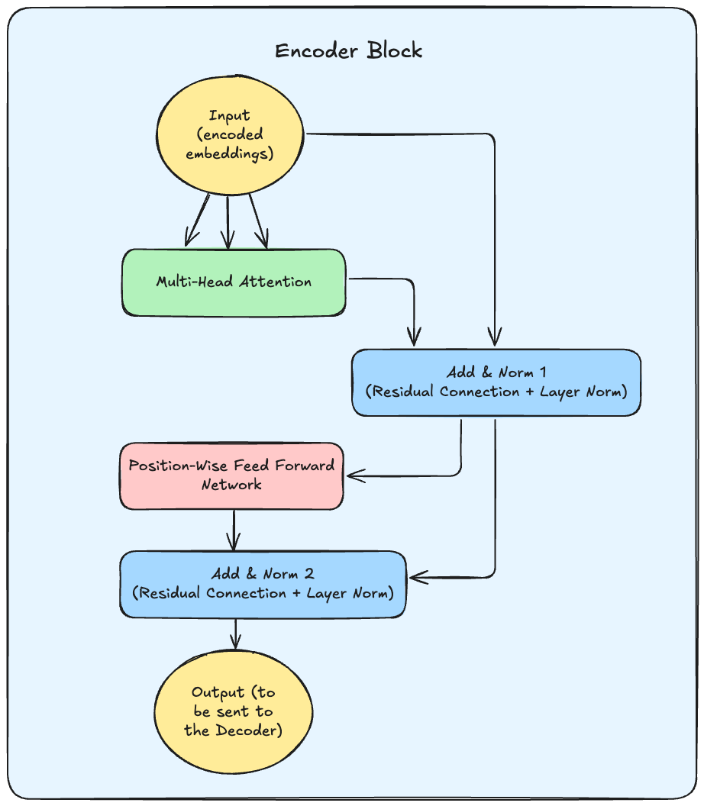
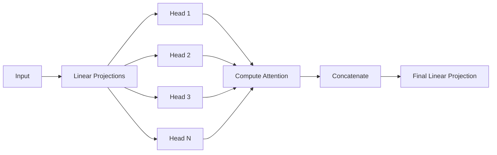
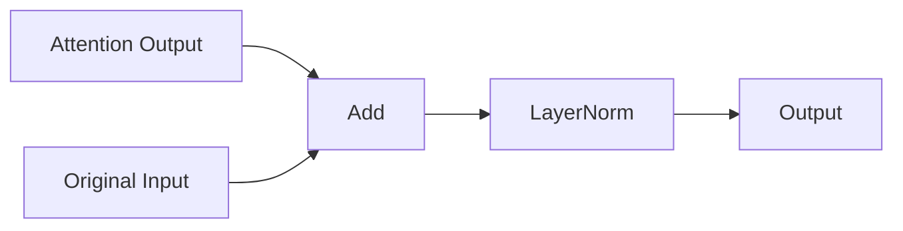
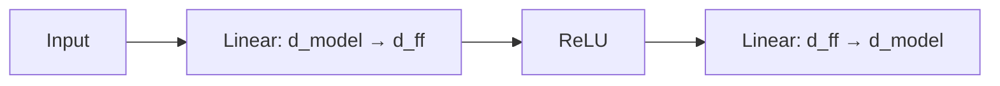
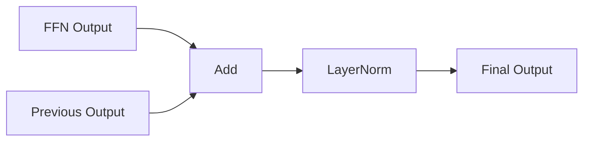

# README

> [!IMPORTANT]
> Currently (re)watching Umar's video. 27:50 minute mark.

# Table of Contents

- [Links and resources I am using](#links-and-resources-i-am-using)
- [Concepts Covered](#concepts-covered)
- [Notes](#notes)
- [Transformer Encoder Block Anatomy](#transformer-encoder-block-anatomy)

---

# Links and resources I am using <a href ='#links-and-resources-i-am-using'>

- [Attention is all you need explanation by Umar Jamil](https://www.youtube.com/watch?v=bCz4OMemCcA&t=1500s)
- [Coding a Transformer from scratch by Umar Jamil](https://www.youtube.com/watch?v=ISNdQcPhsts)
- [Sebastian Raschka's blog](https://magazine.sebastianraschka.com/p/understanding-and-coding-self-attention)
- [Pramod Goyal's blog](https://goyalpramod.github.io/blogs/Transformers_laid_out/)
- and lots of chats with DeepSeek R1

---

# Concepts Covered <a href ='#concepts-covered'>

will be updated as I go along

---

# Notes <a href ='#notes'>

## Transformer Encoder Block Anatomy <a href ='#transformer-encoder-block-anatomy'>

### Data Flow Diagram



### Visualized Mathematical Flow



### Step-by-Step Process

#### 1. Multi-Head Self-Attention



**Key Operations**:

1. Split embedding into `num_heads` different subspaces
2. Each head computes scaled dot-product attention independently
3. Concatenate all head outputs
4. Linear projection to original dimension

#### 2. First Add & Norm (Residual Connection + Layer Normalization for the output of the multi-head attention)



**Mathematically**:

```
LayerNorm(x + Sublayer(x))
```

#### 3. Position-wise Feed Forward Network



**Dimension Example**:
`512 → 2048 → 512`

#### 4. Final Add & Norm (Residual Connection + Layer Normalization for the output of the FFN)



### Critical Properties Table

| Property             | Purpose                                                  | Implementation Note                |
| -------------------- | -------------------------------------------------------- | ---------------------------------- |
| Residual Connections | Prevent vanishing gradients, enable deep networks        | Simple element-wise addition       |
| Layer Normalization  | Stabilize training, reduce sensitivity to initialization | Normalize across feature dimension |
| Multi-Head Attention | Capture different types of relationships simultaneously  | Parallel attention mechanisms      |
| Position-wise FFN    | Add non-linearity and transformation capacity            | Applied independently per position |

### Concrete Example Walkthrough

(for batch size=2, seq_len=4, d_model=512):

1. **Multi-Head Attention**:

```zsh
Input: [2,4,512] → Split into 8 heads → [2,8,4,64]
       ▼
Self-Attention per head → [2,8,4,64]
       ▼
Concatenate → [2,4,512] → Linear → [2,4,512]
```

2. **Add & Norm**:

```zsh
Original: [2,4,512]
Attention Output: [2,4,512]
Add → [2,4,512] → LayerNorm → [2,4,512]
```

3. **FFN**:

```zsh
[2,4,512] → Linear → [2,4,2048] → ReLU → Linear → [2,4,512]
```

4. **Final Add & Norm**:

```zsh
FFN Output: [2,4,512]
Previous: [2,4,512]
Add → [2,4,512] → LayerNorm → Final Output
```

**Code Mapping**:

```python
# Full encoder block sequence:
input = encoded_embeddings  # [2,4,512]
attn_output = multi_head_attention(input)  # Step 1
norm1 = norm(input + attn_output)  # Step 2
ffn_output = ffn(norm1)  # Step 3
final_output = norm(norm1 + ffn_output)  # Step 4
```

---

<p align="center">
    <a href="#table-of-contents">Go to the top</a> | <a href="../0-intro/README.md">Go back to 0-intro</a>
</p>
